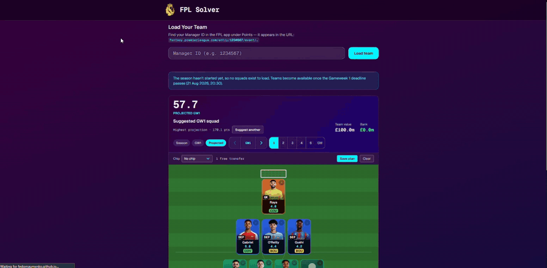

# FPL Solver



Fantasy Premier League Transfer Advisor — a Next.js web app that helps FPL managers make smarter transfer decisions based on form, fixture difficulty, and expected points modelling.

## Features

- **Pitch view** — visualise your squad in a GK → DEF → MID → FWD layout with real FPL player photos and position-coloured cards
- **Points toggle** — switch between season total, current GW actual points, or projected points for any of the next 3 upcoming gameweeks
- **Projected points** — a component model summing how FPL actually awards points: appearance, goals (xG90), assists (xA90), clean sheet as a Poisson zero, goals conceded, saves, bonus and cards. Fixture difficulty and home advantage scale only the attacking and clean-sheet terms; availability (`chance_of_playing_next_round`) scales everything; points-per-game acts as a light prior
- **Drag & drop substitutions** — drag any player card onto another to swap; formation rules enforced (GK↔GK only for keepers, valid 3-4-3/4-3-3/etc. for outfield)
- **Transfer suggestions** — single and multi-transfer plans (1, 2, 3, wildcard) ranked by expected points gain, recalculated per projected GW
- **Apply transfers** — preview your squad after a suggested transfer with live budget and 3-per-club constraint validation
- **Wildcard planner** — greedy optimiser for up to 8 improvements with no points hit
- **Pre-season squad builder** — between seasons FPL has no squad to load (`current_event`
  is null and `entry/<id>/event/<gw>/picks/` 404s), so the app builds the best legal
  £100m XV instead: 2/5/5/3, max 3 per club, ranked on projected points

## Pre-season behaviour

FPL exposes no squad for anyone until a gameweek deadline passes — `my-team/<id>/`
needs a logged-in session cookie, so there is no unauthenticated route to one. Rather
than blame the manager ID, the app says when teams unlock and shows the squad the model
would pick. Note `form` is 0 for every player pre-season, so projections fall back to
last season's points-per-game, and `minutes` is averaged over 38 rather than the
current gameweek (see `getMinutesMultiplier`) — which also stops a single 90-minute
cameo from topping the rankings.

Sanity-check the builder's output against live data at any time:

```bash
node scripts/check-squad-builder.mjs
```

## Getting Started

```bash
npm install
npm run dev
```

Open [http://localhost:3000/fplsolver](http://localhost:3000/fplsolver) (the `basePath`
matches the GitHub Pages path) and enter your **FPL Manager ID** — found in the URL of
your FPL team page:

```
fantasy.premierleague.com/entry/1234567/event/...
                                 ^^^^^^^
```

## How Transfer Suggestions Work

Each player is scored over the selected upcoming gameweek window:

```
xPts = (form × 0.6 + PPG × 0.4) × difficulty_multiplier × minutes_multiplier
```

| Factor | Detail |
|---|---|
| `form` | FPL rolling 4-game average |
| `PPG` | Season points-per-game (fallback when form = 0) |
| `difficulty_multiplier` | `max(0.2, (6 − FDR) / 3)` |
| `minutes_multiplier` | 1.0 ≥60 min/GW · 0.8 ≥45 · 0.5 ≥30 · 0.25 ≥15 · 0 otherwise |

The planner finds the best replacement for each squad player within your available budget, filtered to same position and available status.

## Deploying to GitHub Pages

Pages is static-only, so the app is built with `output: "export"` and all FPL calls
run in the browser. The FPL API sends no `access-control-allow-origin` header, so
those browser calls need a proxy — hence the three steps below.

All three are already done for this repo — kept here for redeploys and forks.

**1. Deploy the CORS proxy** (once), from `worker/`:

```bash
npx wrangler@3 login     # opens a browser
npx wrangler@3 deploy    # prints the https://….workers.dev URL
```

Use `wrangler@3`, not `@latest` — the latter requires Node 22. The Cloudflare
dashboard's "Create application" page is the Git-connected build flow and will not
deploy an inline script, so the CLI is the shorter route.

**2. Set the repo variable** to that URL, **without** a trailing slash:

```bash
gh variable set FPL_PROXY --body https://fpl-proxy.<subdomain>.workers.dev
```

The build fails with a clear error if it is missing, rather than shipping a site
whose every request 404s.

**3. Set the Pages source** to GitHub Actions — Settings → Pages → Source, or:

```bash
gh api -X PUT repos/<owner>/fplsolver/pages -f build_type=workflow
```

Pushing to `main` then builds and publishes to
`https://fedornaumenko.github.io/fplsolver/` via `.github/workflows/deploy.yml`.
Note that GitHub's stock `nextjs.yml` Pages template does **not** work here: it
builds without `FPL_PROXY`, and its `static_site_generator: next` generates a
config that collides with the `basePath` in `next.config.ts`.

`npm run dev` needs no proxy — `next.config.ts` rewrites `/fpl/*` to the FPL API
server-side, where CORS does not apply.

## Tech Stack

- **Next.js 16** (App Router, static export)
- **React 19**
- **TypeScript**
- **Tailwind CSS v4**
- FPL official API (`fantasy.premierleague.com/api`) via a Cloudflare Worker CORS proxy
